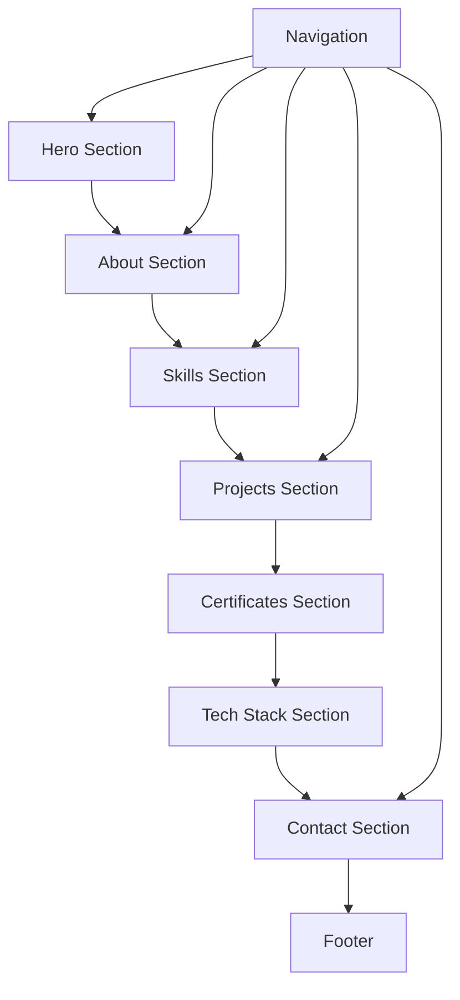

## 1. Product Overview
个人数据分析师作品集网站，展示谭青青的专业技能、项目经验和学习成果。
- 目标用户为潜在雇主和招聘方，展示个人专业能力和数据分析技能。
- 提供清晰、专业的个人品牌形象，突出数据分析领域的专业素养。

## 2. Core Features

### 2.1 User Roles (if applicable)
| Role | Registration Method | Core Permissions |
|------|---------------------|------------------|
| Visitor | No registration required | View all content |

### 2.2 Feature Module
1. **Home page**: hero section, navigation, about, skills, projects, certificates, contact

### 2.3 Page Details
| Page Name | Module Name | Feature description |
|-----------|-------------|---------------------|
| Home page | Hero section | Display name, school, major, and career goal with attractive visual design |
| Home page | Navigation | Fixed top navigation with links to different sections |
| Home page | About | Personal introduction and self-evaluation |
| Home page | Skills | Visual progress bars for technical skills |
| Home page | Projects | Card-based display of data analysis projects with details |
| Home page | Certificates | Card-based display of certificates and competitions |
| Home page | Tech Stack | Detailed breakdown of tools and technologies |
| Home page | Contact | Contact information and social links |
| Home page | Footer | Last update time and personal motto |

## 3. Core Process
Visitors land on the hero section, then scroll through the page to view skills, projects, certificates, and contact information. Navigation links allow quick access to specific sections.

## 4. User Interface Design
### 4.1 Design Style
- Primary colors: Light blue (#3B82F6) and dark green (#10B981)
- Secondary colors: Light gray (#F3F4F6) and dark gray (#1F2937)
- Button style: Rounded corners with subtle hover effects
- Font: Inter (sans-serif) for clean, modern look
- Layout style: Card-based design with ample white space
- Icon style: Minimal, line-based icons for technical tools

### 4.2 Page Design Overview
| Page Name | Module Name | UI Elements |
|-----------|-------------|-------------|
| Home page | Hero section | Large name display, school/major information, career goal statement, subtle background gradient |
| Home page | Navigation | Fixed top bar with smooth scrolling links, responsive design for mobile |
| Home page | Skills | Animated progress bars with percentage indicators, skill category grouping |
| Home page | Projects | Card layout with project name, tools used, brief description, and outcomes |
| Home page | Certificates | Card layout with certificate names and dates |
| Home page | Tech Stack | Grid layout of tool icons and names, grouped by category |
| Home page | Contact | Clean contact information display with clickable links |
| Home page | Footer | Simple design with copyright, last update year, and personal motto |

### 4.3 Responsiveness
- Desktop-first design with mobile-adaptive layout
- Breakpoints for tablet and mobile devices
- Collapsible navigation menu for mobile
- Responsive card layouts that adjust based on screen size

### 4.4 3D Scene Guidance (if applicable)
Not applicable for this project.