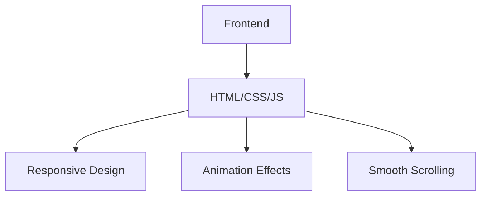

## 1. Architecture Design

## 2. Technology Description
- Frontend: Pure HTML5 + CSS3 + JavaScript
- Initialization Tool: None (single HTML file)
- Backend: None
- Database: None

## 3. Route Definitions
| Route | Purpose |
|-------|---------|
| / | Single page application with all content |

## 4. API Definitions (if backend exists)
Not applicable for this project.

## 5. Server Architecture Diagram (if backend exists)
Not applicable for this project.

## 6. Data Model (if applicable)
Not applicable for this project.

## 7. Implementation Details
### 7.1 File Structure
- index.html: Main HTML file containing all content, styles, and scripts

### 7.2 Key Components
1. **Navigation Bar**: Fixed top navigation with smooth scrolling links
2. **Hero Section**: Name, school, major, and career goal display
3. **About Section**: Personal introduction and self-evaluation
4. **Skills Section**: Animated progress bars for technical skills
5. **Projects Section**: Card-based display of data analysis projects
6. **Certificates Section**: Card-based display of certificates
7. **Tech Stack Section**: Grid layout of tools and technologies
8. **Contact Section**: Contact information and social links
9. **Footer**: Last update time and personal motto

### 7.3 Technical Features
- **Responsive Design**: Media queries for different screen sizes
- **Animation Effects**: CSS animations for skill bars and card hover effects
- **Smooth Scrolling**: JavaScript for navigation link scrolling
- **Dynamic Content**: JavaScript to update the current year in the footer

### 7.4 Performance Optimization
- **Inline CSS/JS**: Single file implementation for faster loading
- **Minimal External Dependencies**: Only Google Fonts for typography
- **Optimized Animations**: CSS transitions for smooth performance

### 7.5 Accessibility
- **Semantic HTML**: Proper HTML5 elements for screen readers
- **Keyboard Navigation**: Tab navigation support
- **Color Contrast**: Sufficient contrast for readability

### 7.6 Deployment
- Static HTML file that can be deployed to any static hosting service
- Compatible with GitHub Pages, Vercel, Netlify, etc.